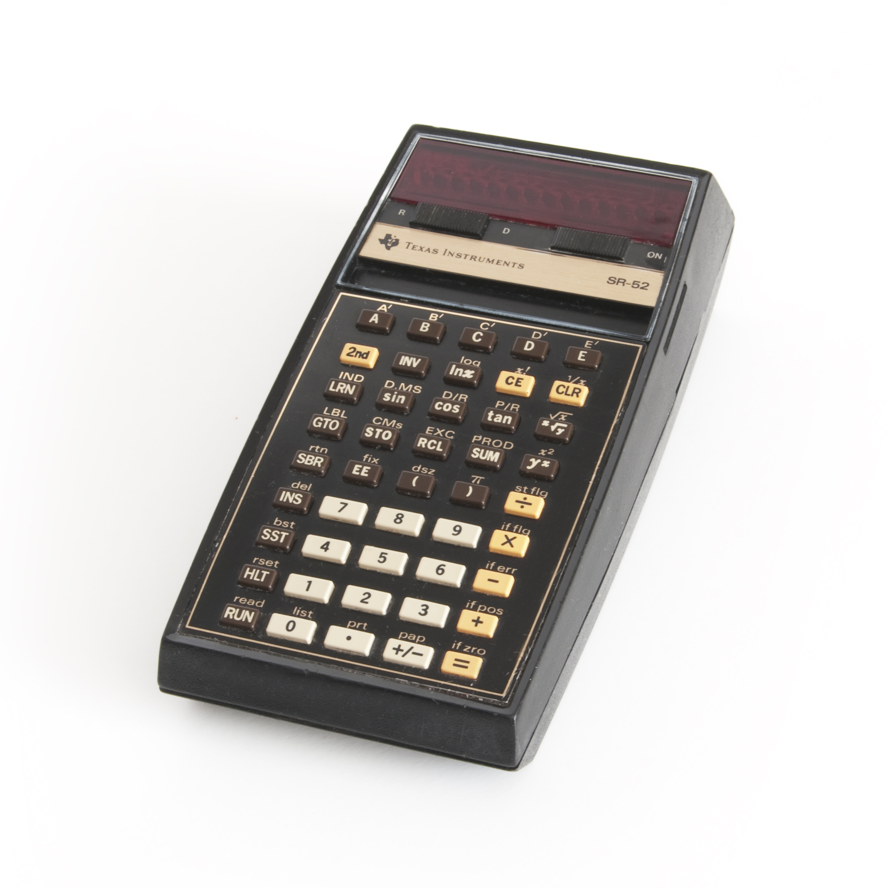
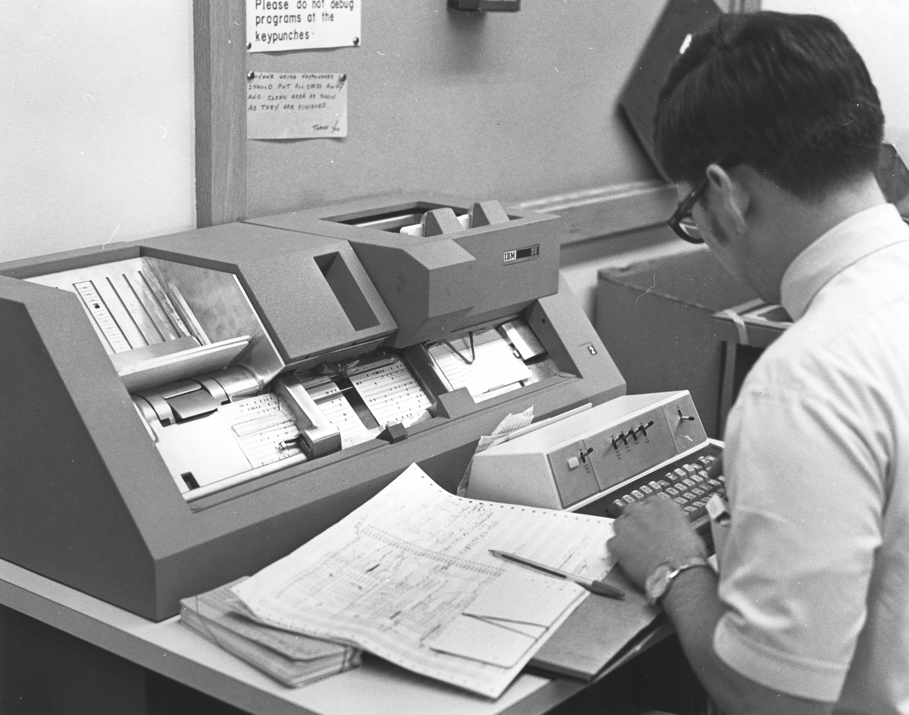
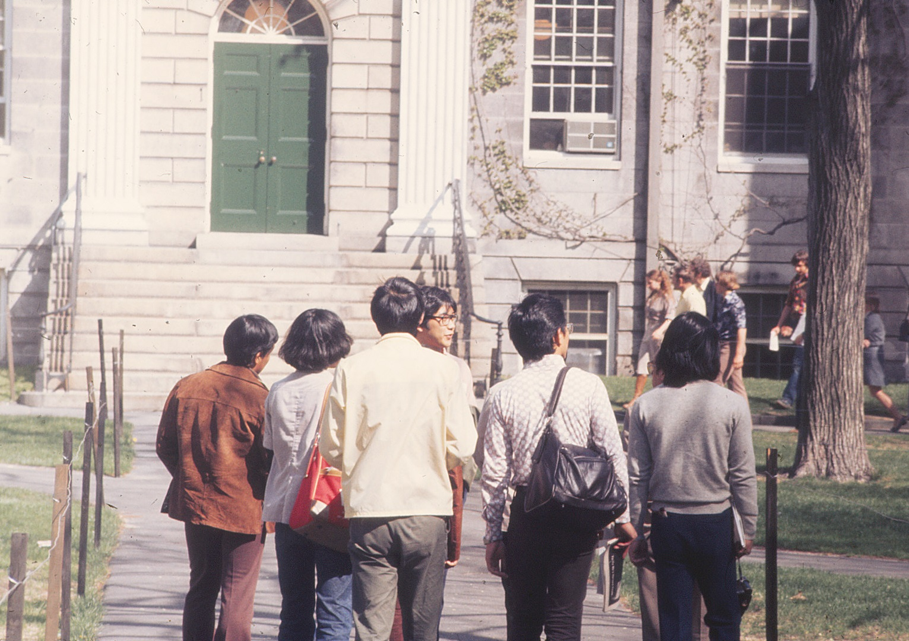
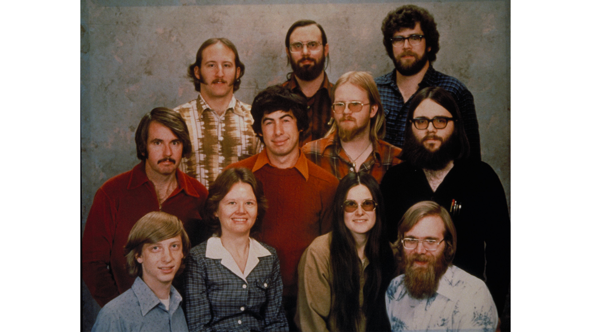

# Гейб Ньюэлл — Глава 1. До Microsoft: от Аспена до Harvard

> Ранние годы Гейба Ньюэлла: семья, Дэвис, первые компьютеры, Trek, интерес к медицине, Harvard и момент, когда временная работа в маленькой software-компании неожиданно стала первой настоящей карьерой.

---

## 1. Родиться благодаря Карибскому кризису

Гейб Логан Ньюэлл родился **3 ноября 1962 года** в Аспене, штат Колорадо.

Уже вокруг самого рождения есть история, которую он много лет спустя пересказывал совершенно в своем стиле. Шел Карибский кризис. Отец Ньюэлла служил в ВВС США и достаточно серьезно относился к возможности ядерной войны. По воспоминаниям Гейба, он смотрел на возможные зоны радиоактивных выпадений и посоветовал беременной жене перебраться подальше от потенциальных целей.

Так семья оказалась в Аспене.

Ньюэлл потом подводил итог примерно так:

> **Cold War paranoia FTW.**

С его биографией это почти идеальная первая реплика. Никакой торжественной истории о том, как будущий миллиардер появился на свет в особенное время. Карибский кризис, страх ядерной войны, беременная мать — и в конце интернетоподобное `FTW`.

При этом Аспен остался скорее красивой точкой в свидетельстве о рождении. Детство и подростковые годы Ньюэлла связаны прежде всего с **Дэвисом, Калифорния** — университетским городом, где он учился, ездил на велосипеде, занимался вполне обычной подростковой работой и постепенно добрался до компьютеров.

---

## 2. Дэвис, семья и старший брат Дэн

У Гейба был старший брат **Dan Newell**. В ранней биографии это один из тех людей, чья роль выглядит почти бытовой, но потом внезапно меняет всю траекторию жизни.

Не Билл Гейтс заметил талантливого студента. Не Microsoft прислала ему письмо. Не существовало никакого грандиозного плана попасть в software industry.

Все было гораздо проще: **Дэн уже работал в Microsoft**.

Именно через брата Гейб позже окажется в офисе молодой компании, начнет проводить там слишком много времени и в итоге получит первую настоящую работу.

До этого была обычная жизнь в Дэвисе. Отец служил в ВВС. Гейб учился в **Davis Senior High School**, которую окончил в 1980 году. Позже он тепло вспоминал преподавателей физики, математики и английского, а еще сам город — компактный, удобный, такой, где до многих мест можно было просто доехать на велосипеде.

И здесь особенно легко совершить типичную ошибку биографий великих технологических людей: представить, будто в школе уже сидел уменьшенный GabeN, который только и ждал, когда появятся Half-Life, Steam и нейроинтерфейсы.

Ничего подобного.

Какое-то время Ньюэлл вполне серьезно думал, что станет **врачом**.

Это не странный каприз до «настоящего призвания». В конце 1970-х медицина выглядела куда более понятной и оформленной профессией, чем software. Индустрия персональных компьютеров только рождалась. Домашний PC еще не был естественной вещью. Само слово «программист» не означало для школьника тот огромный мир профессий, который мы видим сегодня.

Компьютеры пока были не карьерой. Они были очень интересной штукой, к которой хотелось возвращаться.

---

## 3. До software была обычная подростковая работа

До Harvard и Microsoft Ньюэлл успел заниматься работой, в которой вообще не было ничего футуристического.

Он разносил газеты и работал с доставкой телеграмм **Western Union**.

Через сорок с лишним лет эта деталь неожиданно вернется в его жизнь. В 2022 году, когда Valve начала отправлять первые Steam Deck, Ньюэлл лично развез несколько устройств покупателям в районе Bellevue. Он снова стоял у чужих дверей с посылкой в руках и сам вспомнил, как когда-то доставлял телеграммы.

Получился почти слишком красивый круг:

```text
подросток Гейб
доставляет телеграммы

↓

миллиардер Гейб
доставляет Steam Deck
```

Но именно поэтому этот эпизод лучше не превращать в пророчество о будущей цифровой дистрибуции. Он хорош сам по себе. До всей легенды GabeN был парень, который ездил по Дэвису, разносил газеты и телеграммы, а потом шел заниматься компьютерами.

---

## 4. Первый программируемый аппарат — калькулятор Texas Instruments

Первым собственным программируемым устройством Ньюэлл называл **калькулятор Texas Instruments**.

Сегодня слово «калькулятор» звучит почти комично рядом с биографией человека, который потом будет строить Steam и заниматься VR. Но в 1970-х сама возможность заставить маленькое электронное устройство выполнить последовательность команд уже была отдельным видом магии.

Ты не просто нажимаешь `2 + 2`.

Ты задаешь машине порядок действий. Она исполняет его. Если результат неправильный, значит где-то неправильно описана сама процедура.

В этом и есть первый наркотик программирования: устройство делает ровно то, что ты ему сказал, а не то, что ты имел в виду.

Ньюэлл еще не сидел перед полноценным персональным компьютером. Не было IDE, Stack Overflow, GitHub и десяти тысяч tutorial-видео. Но уже существовало главное ощущение: **можно придумать последовательность действий, отдать ее машине и посмотреть, что произойдет**.



*Texas Instruments SR-52, программируемый калькулятор 1975 года.*

---

## 5. Главная роскошь тех лет — не иметь компьютер, а получить к нему доступ

Следующий шаг был гораздо серьезнее. Школа Ньюэлла имела доступ к вычислительным ресурсам **University of California, Davis**.

Вот здесь современному человеку приходится буквально перестраивать голову.

Сегодня компьютер — личная вещь. Он стоит дома, лежит в рюкзаке, помещается в телефоне. Можно изменить одну строку и мгновенно посмотреть результат.

Тогда сама возможность воспользоваться большой вычислительной системой была ресурсом.

Работа могла выглядеть примерно так:

```text
написать программу
↓
подготовить перфокарты
↓
передать задание машине
↓
подождать
↓
получить распечатку
↓
найти ошибку
↓
повторить
```

То есть знаменитый цикл `написал → запустил → увидел ошибку` существовал уже тогда, только между двумя его половинами легко помещалась огромная пауза.

Сегодня backend-разработчик начинает психовать, если тесты идут пять минут. Для Ньюэлла сам feedback мог измеряться совершенно другими промежутками времени.



*Работа с перфокартами в университетском вычислительном центре.*

Эта разница хорошо объясняет, почему люди поколения Ньюэлла так остро чувствовали скорость технологических изменений. Он не читал в книге, что computing стал быстрее. Он начал с мира, где доступ к машине был отдельной процедурой, а потом собственными глазами увидел терминалы, персональные компьютеры, real-time 3D, Internet и VR.

Но в тот момент никакой большой философии из этого еще не существовало. Просто компьютеры становились все интереснее.

---

## 6. Trek — игра, где один ход мог занимать пятнадцать минут

Одной из первых игр, которые Ньюэлл вспоминал как действительно важные для себя, была ранняя компьютерная **Star Trek / Trek**.

По современным меркам это почти издевательство над словом videogame.

Никаких трехмерных миров. Никаких спрайтов. Никакого движения в привычном смысле.

На экране или распечатке — символы, числа, координаты. Enterprise, Klingons, stars. Ты вводишь команду. Система считает новое состояние мира. Потом получаешь результат.

Ньюэлл вспоминал, что один ход мог занимать порядка **10–15 минут**.

То есть вместо `60 FPS`:

```text
примерно 0.001 FPS
```

Или, как он сам шутил, производительность правильнее было измерять в **minutes per frame**.


*Распечатка Star Trek с университетского компьютера, 1975 год.*

Но самое смешное — ему было плевать, что это чудовищно медленно.

Он позже говорил о том опыте очень просто:

> **I was hooked.**

Вот это уже действительно важно.

Чтобы затянуть человека, игре не понадобились графика, актеры, музыка или даже мгновенная реакция. Достаточно было того, что **ты принимаешь решение, а система отвечает новым состоянием мира**.

В дальнейшем Ньюэлл будет любить совершенно разные игры — Doom, Super Mario 64, Dota. Между ними почти нет внешнего сходства. Но в каждой действие игрока имеет вес. Нажал, решил, рискнул, ошибся — и игра ответила.

В Trek эта штука существовала уже в максимально голой форме.

---

## 7. Компьютеры были захватывающими, но все еще не выглядели очевидной профессией

Сейчас мы смотрим на конец 1970-х, уже зная продолжение.

Мы знаем, что будут:

- IBM PC;
- Windows;
- Macintosh;
- Internet;
- смартфоны;
- Steam;
- AI.

У школьника Ньюэлла этого знания не было.

Поэтому его интерес к медицине и поступление в университет не выглядят как короткая ошибка перед истинным предназначением. У него просто существовало несколько возможных жизней, и software еще не победило остальные.

Ньюэлл позже вспоминал, насколько маленьким ему казалось сообщество профессиональных программистов в то время. Числа, которые он называл спустя десятилетия, здесь не так интересны, как само ощущение эпохи: **людей, которые делают software профессией, вокруг очень мало, а будущее этой профессии еще невозможно разглядеть целиком**.

Он уже любит программировать.

Но любить что-то и решить прожить этим жизнь — разные вещи.

Следующий поворот произойдет не из-за очередной машины. Из-за людей.

---

## 8. Harvard

В **1980 году** Ньюэлл поступил в **Harvard University**.

Это место тоже легко превратить в дешевую легенду Silicon Valley:

```text
гений поступает в Harvard
↓
понимает, что университет ему не нужен
↓
бросает его
↓
становится миллиардером
```

Сам Ньюэлл рассказывал историю совсем не так.

Harvard не был для него врагом. Он не строил образ человека, который оказался выше формального образования. Наоборот, университет был нормальным продолжением сильной школьной траектории. Проблема появилась позже: рядом возникла среда, где ему оказалось **намного интереснее и быстрее учиться**.



*Harvard, 1976 год.*

В Harvard он еще сохранял интерес к медицине и математике, но software все сильнее вытягивало внимание на себя. Не потому, что где-то существовал готовый план будущей карьеры. Просто каждое новое соприкосновение с реальной вычислительной техникой давало слишком сильный эффект.

А затем старший брат оказался в нужном месте в нужное время.

---

## 9. Дэн Ньюэлл оказывается в маленькой Microsoft

К началу 1980-х **Dan Newell** уже работал в Microsoft. Он занимался software и инструментами вокруг языка C.

Сегодня слово Microsoft автоматически вызывает огромную корпорацию — Windows, Office, Xbox, Azure, сотни тысяч сотрудников.

Но Microsoft начала 1980-х — совсем другой зверь.

Это еще молодая компания, где дистанция между рядовым разработчиком и людьми вроде Bill Gates или Steve Ballmer несравнимо меньше. Многое решается не через многоэтажный HR-процесс, а буквально потому, что человек оказался рядом, умеет что-то полезное и готов работать.

Гейб приезжал к брату и начал проводить в офисе все больше времени.

Сам по себе образ уже великолепен: студент Harvard приезжает к старшему брату, начинает торчать в software-компании и постепенно становится почти частью мебели.

Он смотрит, как работают люди. Общается. Интересуется задачами. Наверняка слишком часто находится под ногами.

И в какой-то момент это замечает **Steve Ballmer**.

---

## 10. «Если ты все равно здесь торчишь — сделай что-нибудь полезное»

Ньюэлл позже пересказывал сцену примерно так: Балмер увидел студента, который постоянно находится в офисе Microsoft рядом с братом, и поинтересовался — если ты все равно все время здесь, почему бы тебе не заняться чем-нибудь полезным?

Это один из лучших эпизодов всей ранней биографии именно своей будничностью.

Не было собеседования мечты.

Не было письма от Гейтса.

Не было момента:

> «Гейб, мы наблюдаем за твоей карьерой и считаем тебя будущим великим инженером».

Был молодой человек, который слишком часто приходил в офис к брату.

И Балмер фактически сказал:

> Раз уж ты здесь — работай.

С этого начинается тринадцатилетняя карьера.



*Microsoft, декабрь 1978 года: почти вся компания в одном кадре.*

---

## 11. Временная работа, которая начала съедать Harvard

Ньюэлл первоначально не собирался навсегда бросать университет.

Логика была куда менее драматичной:

```text
возьму перерыв
↓
поработаю несколько месяцев
↓
получу редкий опыт
↓
вернусь в Harvard
```

Проблема в том, что возвращаться становилось все менее интересно.

Microsoft давала то, чего университет в тот момент просто не мог дать в той же плотности: живые продукты, настоящих пользователей, реальные ошибки, реальные последствия решений и людей, которые прямо сейчас строили молодую software industry.

Ньюэлл позже говорил, что за несколько месяцев в Microsoft научился больше, чем за годы в Harvard.

Не потому, что Harvard внезапно оказался плохим.

Просто здесь учеба и работа перестали быть разными занятиями.

Ты что-то сделал — и этим действительно кто-то пользуется.

Ты ошибся — проблема настоящая.

Ты не понимаешь — рядом сидит человек, который понимает лучше.

Для Ньюэлла этого оказалось достаточно.

---

## 12. Harvard проиграл не спор, а конкуренцию за внимание

В этой истории нет красивого момента, когда Ньюэлл однажды проснулся и решил:

> Все, университет мне больше не нужен.

Скорее происходило обратное: Microsoft месяц за месяцем становилась реальнее, а возвращение в Harvard — все более теоретическим планом.

Еще один проект. Еще несколько месяцев. Еще одна новая задача.

И постепенно временный перерыв перестал быть перерывом.

Ньюэлл диплом Harvard так и не получил.

Самое интересное здесь даже не dropout как факт. Таких историй технологическая индустрия потом произведет сотни. Интереснее причина, по которой конкретно он остался: **ему нравилась среда, где можно было очень быстро становиться сильнее через реальную работу рядом с сильными людьми**.

Эта мысль потом много раз всплывет в его жизни. Но сейчас она еще не management philosophy. Это просто личный опыт двадцатилетнего человека: здесь я учусь быстрее, значит пока остаюсь здесь.

---

## 13. Молодой Ньюэлл еще очень далек от будущего GabeN

На этом месте особенно полезно не забегать вперед.

У него уже есть программирование. Есть Harvard. Есть Microsoft. Есть знакомство с играми.

Но пока нет почти ничего из того, что обычно ассоциируется с ним сегодня.

Он не game designer.

Не platform owner.

Не миллиардер.

Не человек, который может сказать издателю: «мы не выпускаем игру, даже если вы прекращаете платить».

Не основатель компании без менеджеров.

Не владелец магазина, через который проходят миллиарды долларов.

Он просто очень молодой сотрудник очень молодой software-компании.

И это важная точка, потому что следующие тринадцать лет действительно его переломят. Microsoft даст ему профессиональный масштаб, деньги, уверенность, понимание платформ и очень конкретное представление о том, какой может быть прекрасная software-компания — и во что она может превратиться после роста.

Пока всего этого нет.

Есть человек, который пришел к брату в офис и задержался.

---

## 14. Что уже видно в раннем Ньюэлле

Хотя превращать школьные годы в готовую философию Valve не стоит, несколько вещей к началу Microsoft уже хорошо различимы.

Во-первых, он действительно любит **интерактивные системы**. Trek может быть чудовищно медленной игрой, но возможность принять решение и получить ответ машины уже цепляет его сильнее красивой оболочки.

Во-вторых, он спокойно меняет траекторию, если новая среда оказывается интереснее старой. Медицина не становится обязательством только потому, что когда-то казалась хорошей профессией. Harvard не становится священным только потому, что поступить туда престижно.

И в-третьих, рядом с ним уже несколько раз оказываются люди, которые открывают дверь в следующий мир.

Школа дает доступ к UC Davis.

Дэн дает доступ к Microsoft.

Балмер превращает присутствие в работу.

Дальше такая роль других людей станет для его биографии постоянной: Abrash, Harrington, Carmack, Laidlaw, Walker и многие другие. Ньюэлл редко выглядит как человек, который в одиночку изобретает следующий этап собственной жизни. Обычно рядом появляется сильный человек, новая технология или новая среда — и он решает зайти туда глубже.

Но это уже продолжение истории.

---

## 15. Перед первой настоящей карьерой

К началу 1980-х компьютеры перестают быть для Ньюэлла редким доступом к интересной машине.

Они становятся повседневной работой.

Еще недавно:

```text
перфокарты
↓
принтер
↓
ждать ход Trek
```

Теперь:

```text
офис
↓
команда
↓
реальный software
↓
реальные пользователи
```

Разница огромная.

Именно здесь заканчивается ранняя биография.

Не в момент великого прозрения. Не с обещанием однажды создать Valve. Не с готовым пониманием будущего индустрии.

Просто временная работа оказалась настолько интересной, что человек не вернулся в Harvard.

А следующие **тринадцать лет** он проведет внутри Microsoft.

И вот там уже начнется настоящий взрослый Ньюэлл: Windows, program management, multimedia, platform thinking, Bill Gates, Steve Ballmer, рост компании, первые большие деньги и опыт, без которого Valve потом почти невозможно объяснить.

---

## Источники

- PC Gamer — [The young Gabe Newell thought “I was going to be a doctor”](https://www.pcgamer.com/gaming-industry/the-young-gabe-newell-thought-i-was-going-to-be-a-doctor-until-he-ended-up-visiting-his-brother-at-microsoft-where-steve-ballmer-got-mad-and-said-if-youre-going-to-be-hanging-out-here-why-dont-you-do-something-useful/), 2025.
- PC Gamer — [The first real videogame Gabe Newell played was Star Trek](https://www.pcgamer.com/gaming-industry/the-first-real-videogame-gabe-newell-played-was-star-trek-where-you-made-your-choices-via-punch-cards-before-running-over-to-the-printer-it-usually-takes-about-15-minutes-to-do-a-move/), 2025.
- Computer and Video Games — [Gabe Newell: My 3 favourite games](https://web.archive.org/web/20150211164700/http://www.computerandvideogames.com/296735/features/gabe-newell-my-3-favourite-games/), архивная копия материала 2011 года.
- Academy of Interactive Arts & Sciences — [Gabe Newell — Hall of Fame](https://www.interactive.org/special_awards/details.asp?idSpecialAwards=25), 2013.
- Kotaku — [This Is Gabe Newell in His Freshman Year of High School](https://kotaku.com/this-is-gabe-newell-in-his-freshman-year-of-high-school-5928006), 2012.
- GameSpot — [Watch Gabe Newell Personally Hand-Deliver Steam Decks](https://www.gamespot.com/articles/watch-gabe-newell-personally-hand-deliver-steam-decks/1100-6501106/), 2022.
- PC Gamer — [Watch Gabe Newell deliver Steam Decks and recall his days as a telegram boy](https://www.pcgamer.com/watch-gabe-newell-deliver-steam-decks-and-recall-his-days-as-a-telegram-boy/), 2022.
