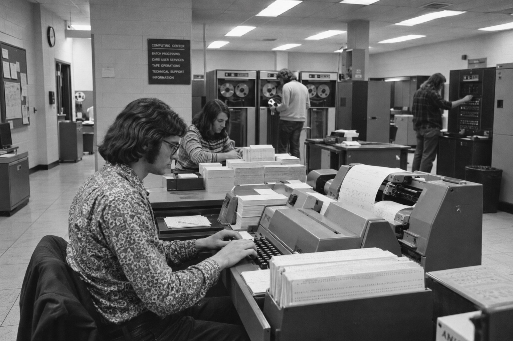
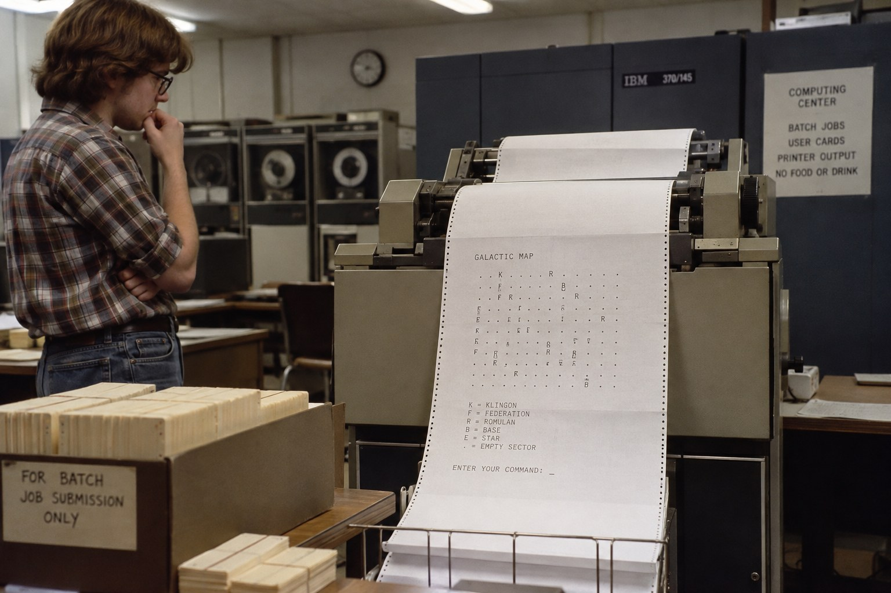
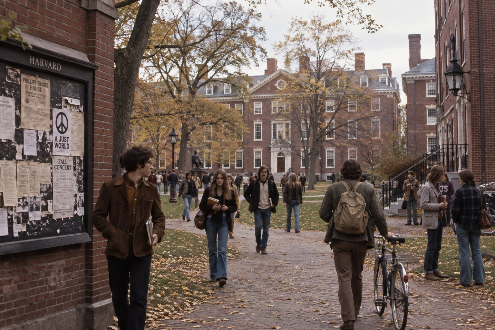
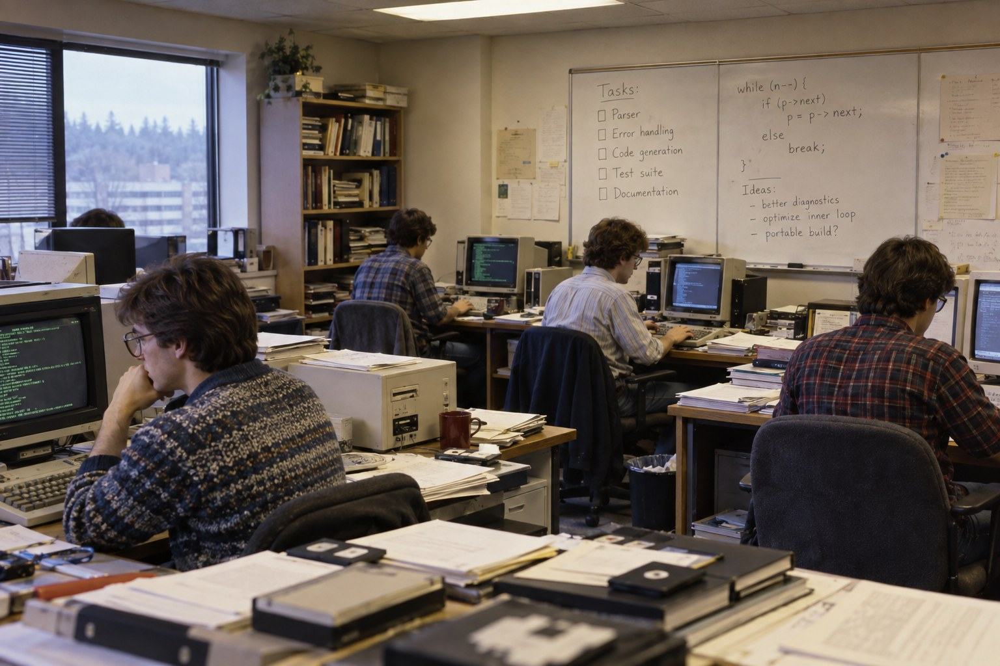

# Гейб Ньюэлл — Глава 1. До Microsoft: от Аспена до Harvard

*1962–1983. Семья, Дэвис, первые вычислительные машины, Star Trek и университетская траектория, которая ещё не предполагала ни Valve, ни Steam.*

[Все главы и справочник](gabe-newell-10-who-is-gabe-newell-final.md#guide) · [Следующая глава: Microsoft](gabe-newell-02-microsoft.md)

## 1. Аспен: семейная история с неожиданной развязкой

Гейб Логан Ньюэлл родился 3 ноября 1962 года в Аспене, штат Колорадо. В его позднем рассказе место рождения связано с тревогой отца, служившего в ВВС США: во время Карибского кризиса тот думал о возможных радиоактивных выпадениях и советовал беременной жене уехать подальше от вероятных целей. Семья оказалась в Аспене. Сам Гейб спустя десятилетия заканчивал эту историю шуткой «Cold War paranoia FTW» — приблизительно «паранойя холодной войны победила».[^early-record]

Это семейное предание в пересказе взрослого сына. Оно позволяет услышать характерную манеру Ньюэлла: тревожный эпизод заканчивается сухой, почти форумной репликой. Однако из него нельзя восстановить всю семейную обстановку. Мы не знаем, насколько часто отец обсуждал с детьми угрозу войны, как именно принималось решение о поездке и какое значение этому придавали остальные родственники.

Такая граница существенна. Популярная биография предпринимателя часто стремится уже в первой сцене обнаружить происхождение будущей смелости, осторожности или независимости. Здесь для этого недостаточно материала. Рассказ говорит о конкретной семейной памяти и о том, как Ньюэлл научился её подавать. Причины его поздних решений придётся искать в обстоятельствах этих решений.

Аспен остался местом рождения. Основная известная история школьных лет связана с другим городом — Дэвисом в Калифорнии. Именно там появляется подросток, которому одновременно интересны точные науки, компьютеры и вполне обычная будущая профессия врача.

## 2. Что известно о семье — и чего эта информация не объясняет

У Гейба был старший брат Дэн Ньюэлл. В дальнейшем Дэн окажется одним из важнейших людей его ранней жизни: через него Гейб попадёт в Microsoft. Но до этого перед нами просто старший брат, который раньше нашёл свою дорогу в программирование и стал для младшего близким, доступным примером существования такой работы.[^early-2025]

Отец служил в авиации; семья жила в Дэвисе; оба брата получили доступ к образованию и вычислительной технике. Этого достаточно для нескольких опорных точек, но недостаточно для уверенного социального портрета. Называть семью бедной, богатой или совершенно «обычной» означало бы добавить характеристику, которой имеющиеся свидетельства не обеспечивают.

Важнее заметить конкретные возможности. Гейб учился в школе университетского города. Он смог пользоваться ресурсами UC Davis. Позднее поступил в Harvard, а затем получил возможность проводить время в офисе компании, где работал брат. Такие обстоятельства не отменяют его способности и интерес. Они показывают, через какие двери эти способности получили шанс проявиться.

Дэн особенно важен именно в этом качестве. Его роль не требует легенды о наставнике, заранее распознавшем будущего основателя Valve. Достаточно того, что он позволил Гейбу увидеть профессиональную среду изнутри. Иногда влияние близкого человека заключается в предоставленной возможности, а содержание этой возможности другой человек осваивает уже самостоятельно.

Отдельного подробного рассказа о многолетних отношениях братьев в доступном корпусе нет. Поэтому Дэн не будет искусственно сопровождать каждую следующую главу. Его надёжно установленный вклад сосредоточен на одном повороте — и этого поворота более чем достаточно, чтобы он не исчезал из биографии.

## 3. Дэвис: город, который остался в памяти

Ньюэлл учился в Davis Senior High School и окончил её в 1980 году. Школьная принадлежность подтверждается, в частности, сохранившимся выпускным альбомом; в поздних воспоминаниях о Дэвисе он выделял занятия физикой, математикой и английским, а также удобство города, по которому можно было передвигаться на велосипеде.[^school]

Эти детали дают более содержательный образ, чем стандартное «с детства интересовался компьютерами». Его память о школе не ограничивается одним кружком программирования. В ней есть преподаватели разных дисциплин, городская среда и повседневная свобода передвижения. Для будущего технического руководителя это не экзотические исключения: человек формируется шире своей последующей должности.

При этом воспоминание взрослого выпускника не заменяет школьный дневник. Оно выбирает то, что сохранилось в памяти и кажется значимым спустя десятилетия. Мы не можем по нескольким тёплым упоминаниям определить его успеваемость по каждому предмету, отношения со сверстниками или положение в классе. Тем более нельзя автоматически назначать его типичным замкнутым компьютерным подростком.

Школьный Ньюэлл интересен своим ещё не определившимся будущим. Ему нравилось разбираться, как устроены вещи. Но из интереса к физике и вычислениям пока не следовало, что он будет всю жизнь заниматься программами. В этой точке биографии медицина оставалась реальным вариантом, а университет — естественным продолжением обучения.

В дальнейшем он неоднократно станет выбирать новые занятия по собственному интересу. Однако школьные годы не стоит превращать в первое исполнение уже готового жизненного правила. Здесь ещё существует обычная неопределённость: увлечение может остаться увлечением, а профессией может стать что-то другое.

## 4. Газеты, телеграммы и работа, у которой был адресат

До Microsoft Ньюэлл разносил газеты и доставлял телеграммы Western Union. В 2022 году, лично развозя первые Steam Deck, он вспомнит эту подростковую работу: в его жизни уже был опыт приезжать по чужому адресу с чем-то, что человек должен получить.[^delivery]

Симметрия забавная, но не пророческая. Между телеграммой и цифровой дистрибуцией нет скрытого плана, который школьник якобы начал осуществлять задолго до появления Steam. В раннем эпизоде важны обычность занятия и физическая конкретность работы: маршрут, адрес, жара, необходимость действительно доставить сообщение.

Такие сведения полезны ещё и потому, что поздняя биография Ньюэлла очень быстро заполняется огромными абстракциями. Миллионы пользователей, платформы, рынки, научные организации, стоимость флота. Подростковая доставка возвращает масштаб к одному человеку, одному поручению и одному получателю. Она напоминает, что известный предприниматель существовал задолго до того, как его имя стало обозначать компанию.

Связь с доставкой Deck подробно вернётся в [личной главе](gabe-newell-08-person-family-games-health-education-public-image.md#public). Там она станет частью публичного образа и постановочного ролика Valve. Здесь достаточно сохранить первоначальный опыт без дополнительной управленческой морали. Нет свидетельства, что именно доставка телеграмм научила Ньюэлла общаться с клиентами или проектировать сервис. Это была работа, которую он делал, и воспоминание, к которому позднее сам вернулся.

## 5. Калькулятор, который можно было заставить выполнять программу

Первым собственным программируемым устройством Ньюэлл называл калькулятор Texas Instruments. В позднем интервью он вспоминал раннее программирование как увлечение, которое появилось прежде ясного представления о профессиональной карьере.[^early-2025]

Модель калькулятора в использованных свидетельствах не установлена достаточно надёжно. Поэтому здесь нет выдуманного номера устройства, языка или первой программы. Известен более простой и существенный факт: у него появился аппарат, которому можно было задать последовательность действий, а затем наблюдать результат.

Для человека, привыкшего к современным компьютерам, это кажется скромным началом. Однако различие между обычным вычислением и программой принципиально. В первом случае пользователь просит машину выполнить отдельную операцию. Во втором — описывает повторяемую процедуру. После этого устройство может воспроизводить задуманную последовательность, обнаруживать ошибки в её построении и выдавать результат, который зависит от качества инструкций.

Этот переход не требует ни графики, ни большого экрана. Удовольствие может возникать уже от того, что собственная идея получила исполняемую форму. Программа либо делает ожидаемое, либо заставляет выяснять, где ожидание было неточным. Такое объяснение помогает понять привлекательность занятия, но не является документированной записью внутренних переживаний подростка Ньюэлла.

В биографии сохранился предмет и позднее воспоминание об интересе. Не сохранились листинги, по которым можно было бы проследить рост его навыков. Поэтому ранний калькулятор остаётся началом практики, а не доказательством исключительного технического мастерства, якобы очевидного уже в школе.

*Контекстная иллюстрация: программируемый калькулятор конца 1970-х. Точная модель устройства Ньюэлла в источниках не установлена.*

## 6. UC Davis: доступ к машине важнее обладания машиной

Следующая возможность была связана с вычислительными ресурсами University of California, Davis. По воспоминаниям Ньюэлла, школьники могли обращаться к университетским машинам, и он познакомился с программированием в среде, где результат не обязательно появлялся сразу на личном экране.[^early-2025][^trek-2025]

Работа с перфокартами и распечатками означала иной ритм. Сначала следовало подготовить задание, затем передать его на обработку, потом дождаться вывода и только после этого понять, что получилось. При ошибке приходилось возвращаться к предыдущему шагу. Современная возможность нажать кнопку запуска несколько раз за минуту здесь отсутствовала.

Важна и организационная сторона доступа. Машина находилась в университете. Ею пользовались разные люди. У школьника не было полного контроля над временем её работы и устройством вычислительной среды. Чтобы заниматься программированием, нужно было пользоваться существующей инфраструктурой и правилами допуска к ней.

Это не делает ранний опыт противоположностью свободы. Напротив, доступ к чужому оборудованию открывал то, чего дома могло вовсе не быть. Университетская среда расширяла круг доступных занятий. Но она одновременно задавала ограничения: вычисления происходили в определённом месте, в определённом порядке и с заметной задержкой.

Поздний Ньюэлл много говорил о скорости обратной связи. Из этого легко вывести красивую историю: будущий руководитель Valve якобы всю жизнь боролся с задержкой, впервые пережитой у университетского принтера. Прямого свидетельства такой причинности нет. Надёжнее сохранить сам контраст опыта. Он действительно помнил вычисления, в которых ожидание занимало значительную часть взаимодействия, и прожил последующее изменение этого ритма.

*Контекстная иллюстрация типичного университетского computing center 1970-х: перфокарты, пакетная обработка и общая инфраструктура вместо персонального компьютера.*

## 7. Как выглядела игра, которую приходилось ждать

Одна из первых игр, о которых Ньюэлл рассказывал с явным увлечением, — ранняя компьютерная Star Trek, также называемая Trek. Это была текстовая система: состояние мира задавалось числами и символами, игрок вводил команды, машина рассчитывала последствия и печатала новое состояние.[^trek-2025]

Здесь нет оснований реконструировать конкретную версию программы до последней команды. У Star Trek существовали разные реализации, и поздний рассказ Ньюэлла не предоставляет полного технического паспорта той, в которую играл именно он. Поэтому обозначения кораблей, звёзд и противников лучше понимать как устройство такого типа игр, а не как достоверно восстановленный экран его первого сеанса.

Его собственная запоминающаяся деталь — продолжительность хода. В пересказах разных лет фигурируют примерно десять–пятнадцать минут. Это воспоминание о масштабе ожидания, не хронометраж. Шутка о «минутах на кадр» передаёт разрыв с привычным измерением производительности в кадрах в секунду.

И всё же он увлёкся. Сам факт важнее технической бедности. Игрок выбирает действие, после чего мир меняется по правилам, которые нужно понять. Можно строить ожидание, ошибаться в расчёте, пробовать иначе. Рассказ о космосе существует здесь вместе с возможностью вмешиваться в происходящее.

Удовольствие не обязано было быть исключительно интеллектуальным. Знакомая фантастическая вселенная, воображаемый корабль и ожидание следующего результата также могли иметь значение. Источник не позволяет аккуратно разложить его привязанность на проценты. Поэтому Trek не следует сводить к сухому доказательству, что Ньюэлл с детства любил только абстрактные системы.

## 8. Что этот эпизод показывает о раннем игроке

Позднее Ньюэлл назовёт Trek среди особенно важных для него игр. В этом выборе есть эмоциональная память о первом увлечении, а не только ретроспективная классификация медиума.[^games-2011]

Такая игра требует заметной работы воображения. Между командой и распечаткой нужно удерживать представление о ситуации. Изображение не делает это за игрока; музыка не сообщает, что сейчас должно быть страшно; актёрская игра не подсказывает отношение к персонажу. Но ограниченность представления не уничтожает вовлечённость. Иногда желание увидеть результат собственного решения оказывается достаточным.

Из этого можно сделать осторожный аналитический вывод: Ньюэлл очень рано узнал, что компьютерное развлечение способно удерживать человека даже при бедной внешней форме. Однако неизвестно, формулировал ли он этот вывод тогда. Возможно, подросток просто хотел сделать следующий ход. Последующее объяснение любимого занятия не обязательно совпадает с первоначальным переживанием.

Эту разницу важно сохранять на протяжении всей биографии. Ньюэлл 2011 или 2025 года уже знает, что создал Valve, участвовал в появлении Half-Life и сделал Steam центральной частью своей профессиональной жизни. Когда он рассказывает о Trek, прошлое проходит через этот опыт. Рассказ остаётся ценным свидетельством, но не превращается в запись мыслей школьника.

Поэтому Trek здесь заканчивается там, где заканчивается эпизод: ребёнок или подросток готов ждать следующего результата. До собственного игрового бизнеса ещё далеко. Нельзя даже сказать, что в этот момент он собирается работать в компьютерной индустрии.

*Реконструкция типа опыта, который описывал Ньюэлл: команда вводится, расчёт выполняется машиной, новое состояние игры приходит на распечатке. Это не снимок конкретной системы UC Davis.*

## 9. Врач был вполне возможным будущим

Ньюэлл рассказывал, что долго ожидал стать врачом. Это не декоративная альтернативная профессия, придуманная для драматического контраста с Microsoft. В его позднем самоописании медицинская траектория действительно присутствует как нормальное представление о собственной взрослой жизни.[^early-2025]

Здесь важно говорить о горизонте конкретного человека. Программирование уже существовало как профессия; компьютерная промышленность не ждала, пока Гейб Ньюэлл её обнаружит. Но школьник мог гораздо яснее понимать, что делает врач, чем представлять себе множество будущих ролей в программном обеспечении. Увлечение вычислениями не давало ему автоматически готового карьерного маршрута.

В этом смысле медицина и компьютеры не обязаны были конкурировать с первого дня. Можно серьёзно думать об одной профессии и с удовольствием заниматься другой областью. Позднейшая развилка становится заметной только после того, как появляется конкретное предложение работы и опыт, который меняет оценку возможностей.

Мы не знаем достаточно, чтобы описывать Ньюэлла как человека, уже поступавшего ради строго определённой медицинской специализации. Интерес к врачебной карьере не равен завершённому плану обучения и практики. Он говорит о направлении ожиданий, а не о прерванной профессиональной квалификации.

Эта открытость полезнее любой истории о предопределении. В юности Ньюэлл ещё мог прожить другую жизнь. Чтобы компьютерное увлечение стало профессией, потребовались люди, место и случай, в котором работа оказалась непосредственно доступной. Следующим таким местом станет Harvard, а решающее знакомство с профессиональной средой произойдёт уже за его пределами.

## 10. Harvard: решение продолжать учиться

В 1980 году Ньюэлл поступил в Harvard University. Его обучение обычно связывают с прикладной математикой; диплома он не получил. Подробного общедоступного перечня пройденных курсов, оценок и академических намерений в использованных источниках нет.[^early-2025][^aias]

Это ограничивает возможный рассказ. Можно уверенно описать поступление, несколько лет университетской жизни и последующий уход в Microsoft. Нельзя без дополнительных свидетельств восстановить разочарование в конкретной кафедре, спор с профессором или момент, когда он якобы решил, что университет больше ничему не способен научить.

Сам Ньюэлл позднее объяснял выбор через сравнительную скорость обучения. В молодой Microsoft практический опыт оказался для него чрезвычайно насыщенным. Но из такой оценки не следует, что Harvard был бесполезен. Он сравнивал два конкретных способа учиться на определённом этапе жизни, имея доступ к обоим.

Это существенное преимущество его положения. Возможность уйти из престижного университета в быстро растущую технологическую компанию отличается от абстрактного отказа от образования. Новый путь уже существовал; рядом были специалисты; работа давала реальные задачи. История не поддерживает универсального совета бросать учёбу ради неопределённой страсти.

В Harvard Ньюэлл ещё оставался студентом, которому нравилось программирование. Позднейшее решение уйти нельзя переносить назад и делать поступление ошибкой, будто бы очевидной с самого начала. Он выбрал университет, попробовал эту среду, а затем получил возможность сравнить её с другой. Именно сравнение, а не изначальная неприязнь к академическому образованию, лежит в его собственном рассказе.

*Контекстная реконструкция университетской среды рубежа 1970–80-х; не документальный снимок Ньюэлла.*

## 11. Старший брат становится человеком из другого мира

К началу 1980-х Дэн Ньюэлл уже работал в Microsoft, в том числе с инструментами программирования. Когда Гейб приезжал к брату, он получал доступ к компании через семейную связь. Это не было конкурсом, в котором незнакомый студент отправил резюме и убедил будущую корпорацию обратить на него внимание.[^early-2025]

Во время одного из таких визитов он стал проводить время в офисе. Поздний рассказ связывает превращение этого присутствия в работу со Стивом Балмером. Тому не понравилось, что молодой человек просто находится рядом; предложение сделать что-нибудь полезное оказалось началом профессионального участия.

Форма эпизода почти комическая. В биографии миллиардера ожидаешь тщательно подготовленного судьбоносного собеседования, а получаешь старшего брата, офис и раздражённое предложение перестать бездельничать. Но здесь действует вполне конкретный механизм: личное знакомство сокращает расстояние между любопытством и возможностью попробовать настоящую задачу.

У нас нет стенограммы разговора. Поэтому реплика Балмера остаётся содержанием воспоминания Ньюэлла, а не театральной сценой с точно восстановленными словами и интонациями. То же относится к последовательности первых поручений: в открытых пересказах она не настолько подробна, чтобы перечислять выдуманные проекты за первые недели.

Дэн изменил положение Гейба прежде всего тем, что сделал профессиональный мир наблюдаемым. После этого интерес младшего брата мог пройти проверку реальной работой. Способность пользоваться такой возможностью принадлежит самому Гейбу, но возможность не следует вычёркивать из рассказа о его самостоятельности.

## 12. Компания ещё не была памятником собственному успеху

Microsoft начала 1980-х существенно отличалась от поздней корпорации, с которой обычно связывают это имя. Для Ньюэлла она была местом, где можно было оказаться рядом с людьми, непосредственно создающими продукты, и довольно быстро перейти от наблюдения к участию.[^early-2025][^wp-customers]

Не стоит идеализировать всю организацию на основании удачного личного опыта. Неформальный доступ одного родственника сотрудника не означает отсутствия отбора, ответственности или сложностей для остальных кандидатов. Однако в его истории дистанция действительно оказалась короткой: брат, офис, разговор, полезная работа.

Для молодого человека это меняет само представление о профессии. Раньше программирование можно было воспринимать как интересное занятие, доступное на калькуляторе или университетской машине. Теперь рядом находились люди, для которых оно составляло ежедневную работу, а результат должен был использовать кто-то за пределами комнаты.

Меняется и характер проверки. Учебная задача обычно заранее ограничена; профессиональная проблема может оказаться плохо сформулированной. Требуется понять, что нужно сделать, договориться с другими, довести решение до пригодного состояния и принять последствия ошибок. Это общее различие помогает понять привлекательность среды, но не является подробным отчётом о первой должности Ньюэлла.

Он вошёл в Microsoft ещё до того, как ранние Windows стали выпущенными продуктами. Полная история его работы начнётся в следующей главе. Пока существенно другое: впервые появился достаточно убедительный ответ на вопрос, может ли программирование быть не только увлечением, но и содержательной повседневной жизнью.

*Контекстная реконструкция небольшой software-компании начала 1980-х: CRT-терминалы, бумажная документация и тесная работа инженеров. Это не архивное фото Microsoft.*

## 13. Временный перерыв, который не закончился возвращением

Первоначально Ньюэлл не описывал работу в Microsoft как окончательный отказ от Harvard. В его позднем рассказе это был временный перерыв: поработать, получить опыт и затем вернуться. На практике возвращение всё откладывалось, а компания становилась основным местом его жизни.[^early-2025]

Такой переход отличается от публичного жеста «я бросаю университет». Решение может складываться постепенно. Каждый следующий месяц даёт новые задачи и связи; возвращение перестаёт выглядеть очевидным продолжением; новый путь становится реальнее прежнего. Это возможный способ понять рассказ, но не точная реконструкция внутренних колебаний, о которых он подробно не говорил.

Надёжно известен результат: примерно с 1983 года начинается его работа в Microsoft, продолжившаяся тринадцать лет. Академический маршрут остался незавершённым. Впоследствии Ньюэлл говорил, что в компании за короткое время научился больше, чем за годы университетского обучения.[^aias][^early-2025]

Такое сравнение субъективно. Оно сообщает, где он ощущал собственный рост, а не измеряет качество Harvard и Microsoft на универсальной шкале. Для человека, уже увлечённого программированием, непосредственная работа с сильными специалистами могла оказаться особенно продуктивной. Другому студенту с другой целью тот же выбор мог бы ничего подобного не дать.

Самое важное изменение пока довольно скромное: Ньюэлл перестаёт только изучать возможную профессию и начинает её выполнять. Он ещё не собственник, не создатель организации и не человек, определяющий направление игровой индустрии. Он молодой сотрудник, которому предстоит доказать, что интерес способен выдержать настоящую работу.

## 14. Чему этот поворот ещё не научил

Уход из Harvard часто используют как объяснение будущего отношения Valve к дипломам. Связь возможна, но её нельзя понимать слишком прямолинейно. Личный опыт показывает Ньюэллу, что формальная образовательная траектория и фактическая способность работать могут расходиться. Будущая практика найма потребует множества дополнительных наблюдений — уже в Microsoft и собственной компании.

Точно так же раннее увлечение Trek ещё не содержит готовой теории игрового дизайна. Студент, которому понравилась интерактивная программа, не становится автоматически знатоком постановки, анимации, экономики цифрового магазина или поведения сообщества. Эти компетенции появятся гораздо позднее и будут принадлежать не ему одному.

Важнее перечислить то, чего он пока не знает. Он не выпускал крупный программный продукт в роли основателя. Не набирал команду для собственной студии. Не сталкивался с необходимостью оплачивать переработку игры из личных средств. Не объяснял миллионам пользователей, почему обещанный релиз не состоялся. Даже финансовая независимость, которой позднее будут объяснять многие его решения, ещё должна возникнуть.

Это сохраняет движение биографии. Следующие главы не просто подтвердят характер, уже законченный к двадцати годам. Они покажут, как человек приобретает профессиональные навыки, деньги, уверенность, власть и новые ограничения. Часть ранних интересов сохранится, некоторые оценки изменятся, а отдельные удачные привычки начнут давать неожиданные последствия.

На пороге Microsoft у него есть любопытство, уже накопленный опыт программирования, доступ к сильной среде и готовность остаться там, где работа увлекает. Для начала первой карьеры этого достаточно. Для объяснения всей последующей жизни — пока нет.

## 15. Память взрослого человека и незавершённость ранней истории

Почти все живые эпизоды этой главы дошли в поздних рассказах. Ньюэлл вспоминает калькулятор, университетские вычисления, Trek, брата и Балмера уже после того, как его имя стало известным. Такая память неизбежно избирательна: она сохраняет неожиданные повороты, характерные реплики и простые сравнения.

Это не повод отвергать рассказ. Без воспоминаний ранняя биография многих технологических предпринимателей превратилась бы в несколько дат. Но их нужно читать в правильном масштабе. История про Балмера объясняет, как Ньюэлл помнит вход в Microsoft. Она не доказывает, что в найме участвовал только один человек. Фраза о быстром обучении объясняет его оценку выбора. Она не отменяет значения предшествующего образования.

Точно так же пробелы не следует заполнять стандартными биографическими шаблонами. Здесь нет подтверждённого конфликта с родителями из-за Harvard, нет установленной бедности, которую программирование якобы позволило преодолеть, нет основания превращать Гейтса в человека, лично «открывшего» Гейба. Отсутствие таких сюжетов делает начало менее гладким, но более точным.

Поворот уже состоялся без дополнительной драматизации. Человек, который допускал для себя медицину и учился в Harvard, нашёл новую профессиональную среду через старшего брата. Временная работа стала постоянной. Теперь интересу предстояло пройти более строгую проверку: не тем, хочется ли сделать следующий ход в игре, а тем, получается ли создавать программы, которыми смогут пользоваться другие.

## 16. Следующая жизнь начинается с работы

К началу Microsoft-периода у Ньюэлла ещё нет законченного объяснения самого себя. Он не пришёл в компанию, чтобы накопить деньги на Valve, и не занимался ранними компьютерами ради будущего цифрового магазина. Перед ним были ближайшие задачи и люди, у которых можно было учиться.

На этом ранняя глава заканчивается. Дальнейшее развитие не требует ещё одной сводной схемы от перфокарт до нейроинтерфейсов. Достаточно заметить переход масштаба: вычислительная машина перестаёт быть редкой возможностью, которую удаётся получить в свободное время, и становится предметом ежедневной профессиональной ответственности.

В [следующей главе](gabe-newell-02-microsoft.md) Microsoft будет показана изнутри его первой карьеры: ранние Windows, координация сложной разработки, мультимедиа, новые направления и постепенное увеличение дистанции между отдельным сотрудником и компанией. Там же возникнут деньги, которые изменят характер его следующего выбора, и представления об организации, которые позднее окажутся полезными — и спорными — уже в Valve.

## Источники и границы реконструкции

Ранняя часть опирается прежде всего на поздние воспоминания Ньюэлла. Точная модель его первого калькулятора, листинги школьных программ, подробный учебный план Harvard и последовательность первых поручений в Microsoft здесь не восстановлены. Отсутствующие сведения не заменены типовыми сценами из истории компьютерной индустрии.

Дата рождения и школьная хронология сохранены из исходного биографического корпуса; для семейной истории об Аспене важна именно атрибуция самому Ньюэллу. Сведения об отце не дают основания оценивать достаток семьи. Приблизительные десять–пятнадцать минут на ход Trek относятся к воспоминанию о длительности, а не к измеренной производительности конкретной машины.

[^early-record]: Предоставленная пользователем исходная глава 1: семейная история об Аспене, службе отца и раннем Дэвисе. Используется только как исходный материал с явно обозначенными границами подтверждения.

[^early-2025]: PC Gamer, [The young Gabe Newell thought “I was going to be a doctor”](https://www.pcgamer.com/gaming-industry/the-young-gabe-newell-thought-i-was-going-to-be-a-doctor-until-he-ended-up-visiting-his-brother-at-microsoft-where-steve-ballmer-got-mad-and-said-if-youre-going-to-be-hanging-out-here-why-dont-you-do-something-useful/), июль 2025, по интервью Залкару Салиеву.

[^school]: Kotaku, [This Is Gabe Newell in His Freshman Year of High School](https://kotaku.com/this-is-gabe-newell-in-his-freshman-year-of-high-school-5928006), 21 июля 2012. Davis Senior High School и школьная фотография.

[^delivery]: GameSpot, [Watch Gabe Newell Personally Hand-Deliver Steam Decks](https://www.gamespot.com/articles/watch-gabe-newell-personally-hand-deliver-steam-decks/1100-6501106/); PC Gamer, [Watch Gabe Newell deliver Steam Decks…](https://www.pcgamer.com/watch-gabe-newell-deliver-steam-decks-and-recall-his-days-as-a-telegram-boy/), февраль–март 2022.

[^trek-2025]: PC Gamer, [The first real videogame Gabe Newell played was Star Trek](https://www.pcgamer.com/gaming-industry/the-first-real-videogame-gabe-newell-played-was-star-trek-where-you-made-your-choices-via-punch-cards-before-running-over-to-the-printer-it-usually-takes-about-15-minutes-to-do-a-move/), 2025. Позднее воспоминание о Trek и длительности хода.

[^games-2011]: Computer and Video Games, [Gabe Newell: My 3 favourite games](https://web.archive.org/web/20150211164700/http://www.computerandvideogames.com/296735/features/gabe-newell-my-3-favourite-games/), 4 апреля 2011, архивная копия.

[^aias]: Academy of Interactive Arts & Sciences, [Gabe Newell — Hall of Fame](https://www.interactive.org/special_awards/details.asp?idSpecialAwards=25), 2013. Официальная краткая биография Microsoft-периода.

[^wp-customers]: Andrea Peterson, The Washington Post, [Gabe Newell on Valve’s intimate relationship with its customers](https://www.washingtonpost.com/news/the-switch/wp/2014/01/06/gabe-newell-on-valves-intimate-relationship-with-its-customers/), 6 января 2014.
